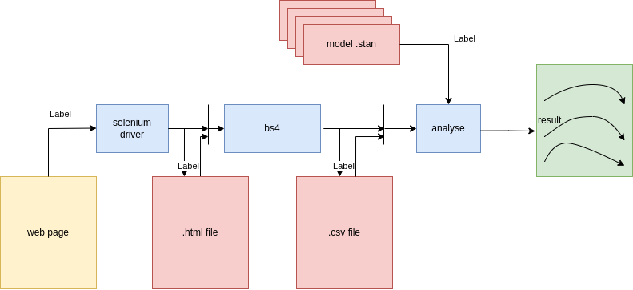

# Touhou Vote Analysis 

東方プロジェクト人気投票の解析

Bayesian analysis of Touhou project vote data

## data source
- https://toho-vote.info/result
- https://toho-vote.info/results

China(optional)
- https://touhou.vote/nav/ 
- https://touhou.vote/v10/?result=true 

### related information
- http://thwiki.info/?%BD%D0%B1%E9%A5%EA%A5%B9%A5%C8 title & charactors
- http://thwiki.info/?%A5%AD%A5%E3%A5%E9%CA%CC%A5%B9%A5%DA%A5%EB%A5%AB%A1%BC%A5%C9%2F1#v5aac3bf spell cards &charactors
- https://touhou.arrangement-chronicle.com/statistics music
- https://w.atwiki.jp/toho/pages/842.html#id_713b4b9a title & music & charactors
- pixiv ranking illustration
- https://docs.google.com/spreadsheets/d/1YKpwyCOLRWiC9jucljunxS41i75zUYojI3qx1JnIpVI/edit?usp=sharing

### related articles
- https://booth.pm/ja/items/2025481
- https://hisayukihonbun.booth.pm/tems/760429
- https://www.pixiv.net/artworks/68538151
- https://docs.google.com/spreadsheets/d/1NbdTXrPqA3df5wS37emN3RMFDH9Re2nApleYTlGKsp8/edit#gid=753814927

## method
### summary of elections
 

### scraping

### EDA

### correcation between title/character/music ranking

### relation between stages and votes

### bayesian analysis
 analysis.py

Bayesian analysis by using pystan/gensim

<!--
architecture

made by https://app.diagrams.net/
-->

## model
### basic models
#### power(charm) model
for normalized vote numbers

$$
normVote_{i,t} \sim Dir(\sum_{l=1}^{TM} main_{j(i,t-l),t-l} \sigma_{j,l} \\ + \sum_{l=1}^{TM} boss_{j(i,t-1),t-l}Lv_i b_{j(i,t-l),l} 
\\ +\sum_{l=1}^{TM} sub_{j(i,t-l)} s_{j,l}
 )
$$

##### table flags (1 or 0)
- $main_{j(i,t),t}$ i is main character of subtitle just before tth election
- $boss_{j(i,t),t}$ i is boss character of subtitle just before tth election
- $Lv_i$           boss level of character i
- $sub_{j(i,t),t}$ i is character of noninteger subtitle just before tth election
##### parameters
- $\sigma$ coef of integer title main characters 
- b coef of integer title bosses
- s coef of noninteger title members
##### index
- t index of time(election)
- l index of realtive time
- i index of characters
- j index of mainchar,boss,subtitle table

#### subtitle model(topic model)

$\theta_m \sim Dir(\alpha)$ K dimension

$\phi_m \sim Dir(\beta)$ V dimension

$z_n \sim Cat(\theta_m)$  K dimension

$w_n \sim Cat(\phi_{z_n})$ V dimension

- V num. of characters
- K num. of titles
- N num. of total votes
- M num. of elections
- $\alpha, \beta$ hyperparameter 

caluculate by using gemsim

## Reference
- https://mc-stan.org/docs/stan-users-guide/index.html
- https://statmodeling.hatenablog.com/entry/topic-model-4
- https://radimrehurek.com/gensim/
- https://atmarkit.itmedia.co.jp/ait/articles/1905/22/news007.html
