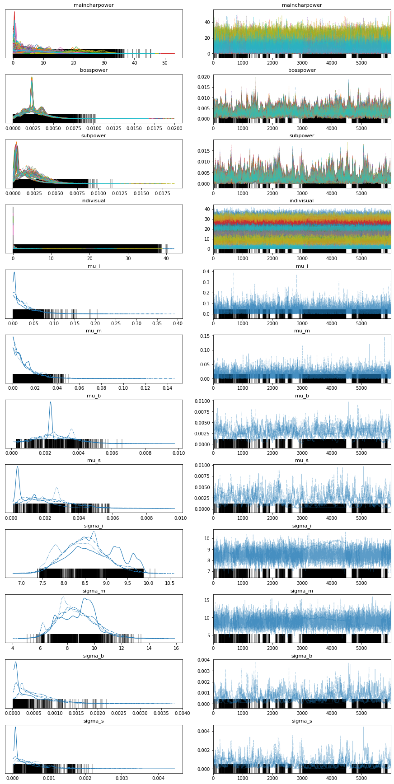
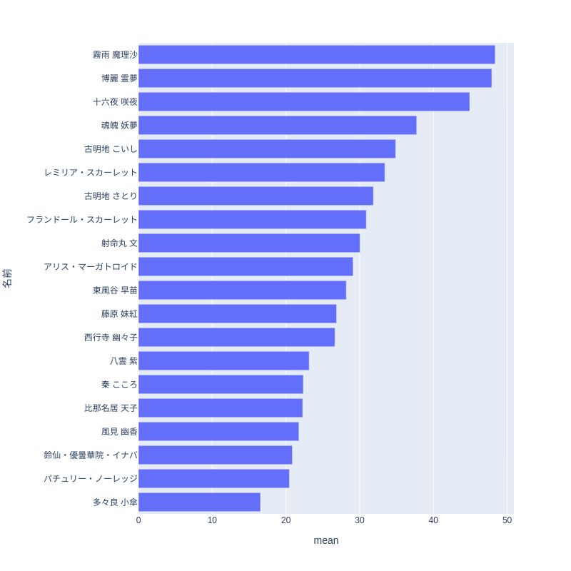
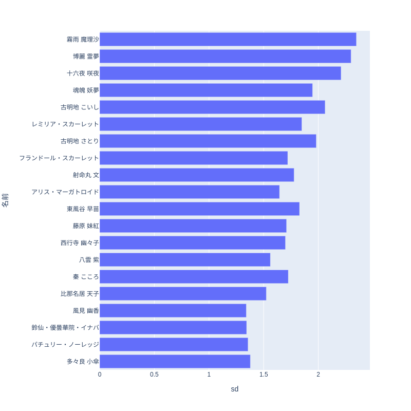
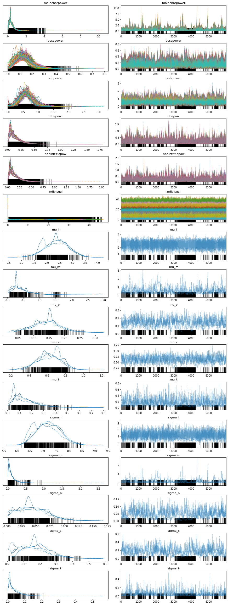
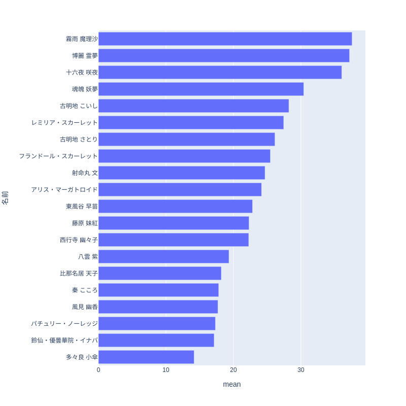
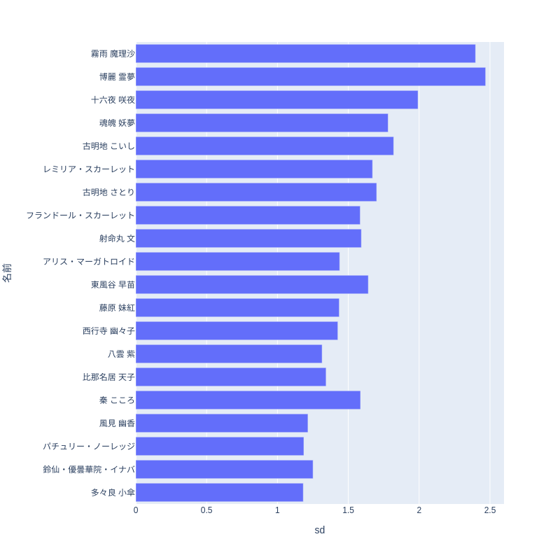
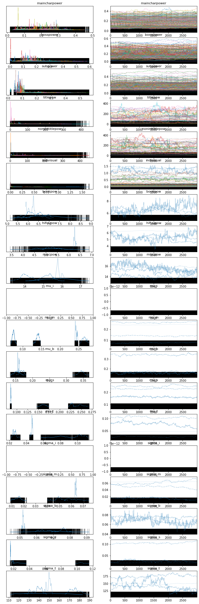
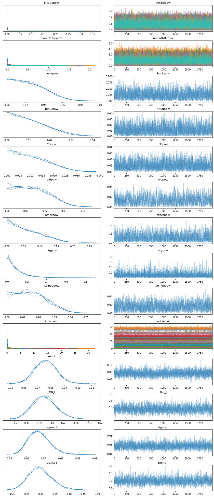
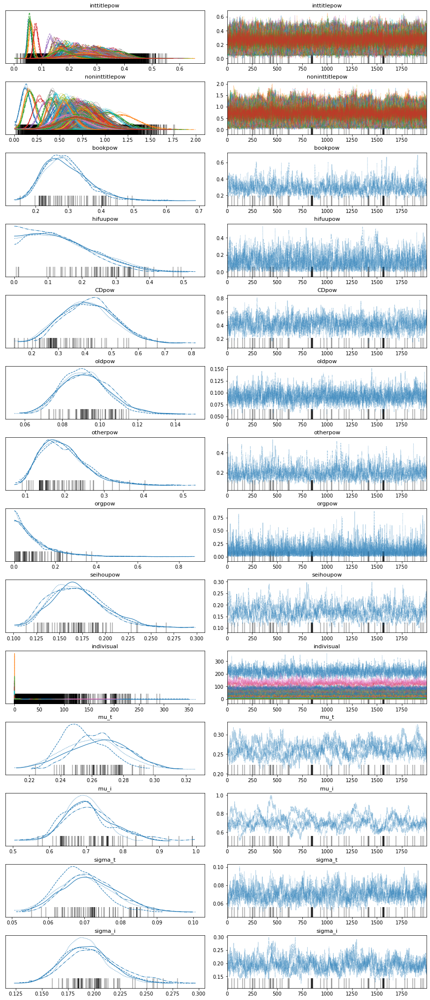

//ベイス
ここではベイズ統計モデリングという手法を使って投票データの傾向の説明を試みた結果を書きます。

=== ベイズ統計について

例えば人気投票の全期間を通じて人気のあるキャラクターは誰か、あるいは登場作品がどの程度人気に影響を与えているかを説明したいとします。

統計学では検定と呼ばれる方法で限られたデータから上記のような主張が言えるかどうかを判定することができます。しかしながらその解釈はやや難解でまた個々の仮説に対してそれぞれ検定を行うのは煩雑でもあります。

別の方法としてデータが満たす性質を数式でモデル化し、モデルがどの程度データにあっているかを計算で求める手法がありベイズ統計モデリングと呼ばれます。この手法の場合モデルやその中のパラメーターがどの程度確からしいかという度合いも確率分布としてデータから推測するとします。確定している事実に対して確率を持ち出すのは奇妙にも思えますがわからないことに対する信念の度合いという風に解釈することもできます。

データxから推定されるパラメーターθの満たす分布(事後分布) p(θ|x)の推定には
データの性質を考えて設定した事前分布p(θ)とモデルによって決まる条件付き確率(尤度) p(x|θ)に対してベイズの定理と呼ばれる定理から

stem:[ p(\theta|x) \prop p(x|\theta)p(\theta)]

という形に書かれます。これは比例の形であり、これだけでは事後分布の分母の値はわかりません。そこでマルコフ連鎖モンテカルロ法(MCMC)と呼ばれる手法でサンプリングすることで分布(事後分布)を推定します。これはあるパラメーター全体が取りうる空間内のある点θを最初に決め、それに対してパラメータを異なる値θ'に確率

stem:[ min(1,(p(x|\theta')p(\theta'))/(p(x|\theta)p(\theta))) ]

で移動させます。このようにして一点一点逐次的に計算を行い、その軌跡(trace)を十分長い時間をかけて取ると一定の分布(定常分布)として事後分布p(θ|x)が得られることになります。

本書で用いるstanではさらにMCMCに加速度をつけるHMC(Hybrid Monte Carlo)という方法と遷移幅を調整するNUTS(No-U-turn sampler)という手法でサンプリングの効率を上げています。その詳細は「岩波データサイエンス」シリーズ、「計算統計II」などの書籍やStan Reference Manual(https://mc-stan.org/docs/reference-manual/hamiltonian-monte-carlo.html )をはじめとしたWeb上の情報を参照してください。

=== 言語とツール

ここではpythonのライブラリpystanを用いてモデルの記述をします。stanは統計モデルを記述する専用の言語であり以下に紹介するようにpythonやRなど他の言語から呼び出されて推論計算を実行する形式になっています。stanの文法の詳細は以下でのコードの説明および「StanとRでベイズ統計モデリング」などを参照してください。
他にもpythonのライブラリpymcを用いる方法もありpythonの文法に基づいたモデルの記述ができますが、推論で使われる内部的な計算は変わりありません。

以下のモデリングと結果で説明する最初のモデリングに対応したコードは以下のようなものになります。
```python
include::../analyse_char.py[]
```

stanやpymcではMCMCの計算に関するコードはライブラリの中で見えないようになっており、pythonからのstanで書かれたコードを呼び出す場合は上記コードのように単にbuildmodel.sample関数を実行するだけです。
呼び出される対象であるstanで書いたコードは以下のようになります。

```
include::../model/charpower_template_hyper.stan[]
```
data{}内が入力されるデータ、parameters{}内が推定対象のパラメーターを定義しておりmodel{}内がdataとparameterを用いて書かれるモデルの数式になります。ただし


事後分布のMCMCの計算結果はchainという時系列的な単位で行われます。複数のchainを計算しその結果を比較することで推論の計算が正しく行われたかがわかります。初期状態への依存が消え去っておらずモデルが妥当ではないと判断できることになります。
収束したか否かはGelman-Rubin統計量(Rhat)と呼ばれる量で判断します。これは初期状態の近く(burn-in期間)を除いたj番目のchainのi番目のパラメーターstem:[\theta_{ij}]の総ステップnとchain数mに対する

chain間分散 stem:[B=n/(m-1) \sum_{j=1}^m (\bar{\theta}_j - \bar{\theta} )^2]

chain内分散 stem:[W=1/(n(m-1)) \sum_{j=1}^m \sum_{i=1}^n (\theta_{ij}- \bar{\theta}_{i} )^2]

から計算される定常分布の分散

stem:[hatV = ((n-1)/n)W+(1/n)B ]

を用いて

stem:[hatR = \sqrt{hatV/W}]

と書かれます。stem:[hatR]が1~1.1の間の値の場合は事後分布が定常分布に収束したということを意味します。

traceとして得られた事後分布の可視化にはarvizというライブラリを使います。本書ではtrace, summary, forestというプロットの結果を記載します。これらはそれぞれ

- summary 各推定対象のパラメーターの平均、標準偏差、stem[hatR]などのcsvデータ出力
- trace chainの時間的動き(右)とそのヒストグラムを重ね書き(左)する
- forest 事後分布のばらつきを箱ひげ図でプロットする

といった関数を用います。

=== モデリングと結果

統計モデリングをするということは何かを説明したいという意図があります。前章のドメイン知識を含むような関係をモデルの数式で表現し、それがどの程度妥当なのかを投票データとMCMCによる計算によって明らかにします。

==== キャラクター

が初登場の作品に

- 和モデル

stem:[
 nVote_{i,t} ~ Dir(\sum_{l=1}^{TM} M_{j(i,t-l),t-l} \sigma_{j,l} \\ + \sum_{l=1}^{TM} boss_{j(i,t-1),t-l}Lv_i b_{j(i,t-l),l} 
 +\sum_{l=1}^{TM} Sub_{j(i,t-l)} s_{j,l}+\epsilon_i
 )
]

Dirというのはディリクレ分布で各要素の合計が1になるようなベクトルに値を持つ確率分布関数です。正規化した投票結果に対して用いることができます。Dirのパラメーターは

 - 整数作品の登場キャラ M
 - 整数作品のボスキャラ bossとそのレベル Lv
 - 非整数作品 Sub
 - 秘封倶楽部、その他

に対応する推定対象のパラメーターである係数sigma b,s,と各キャラクターがそれぞれの属性に当たるかを示す変数との積の和
で構成されます。非整数作品でのみ登場するキャラと再登場キャラは区別していませんが、同一の影響を受けると仮定しました。また以前の投票結果(人気)に応じて再登場の機会が変わると考えられますがその効果も明示的に入れていません。

このようにデータをグループ分けするモデルは階層モデルと呼ばれます。今回のキャラとそれが登場した整数作品のような階層的な関係が実際にある場合に自然な過程となります。
データの分布の観点からは階層モデル、特に個体(individual)ごとのバラツキを考慮した混合モデルはデータのばらつきが大きくなってしまう過分散と呼ばれる問題に対処できるとされます(「個体差」の統計モデリング http://hdl.handle.net/2115/26401 )。

別のモデルとして投票期間によらない作品の影響力を加えたモデル

も考えられます。結果として計算された事後分布は以下のようになります。

[]

ベクトルのパラメーターは各要素を重ね合わせて描いています。chainによって分布が大きく変わらないことも確認できます。

特にindivisualの影響が大きくまた紅魔郷が強いこと、　などがそこに現れています。
//以下のモデルを考えます。個体の効果が上位に
//image::img/posterior_charm_hyper.png[width=40%][]
[]
[]

- 和モデル(旧作、秘封、その他に時間依存性を入れた場合)

微妙に違うモデルとして旧作、秘封、その他にも時間による減衰効果を入れたモデル
//sumnidivisual dth[i]=(sum(mains)+sum(bosses)+titlebase+sum(subs) +noninttitlebase +sum(hifuu)+sum(book)+sum(misc))+indivisual[i];
stem:[
 nVote_{i,t} ~ Dir(\sum_{l=1}^{TM} M_{j(i,t-l),t-l} \sigma_{j,l} + \sum_{l=1}^{TM} boss_{j(i,t-1),t-l}Lv_i b_{j(i,t-l),l} 
 +\sum_{l=1}^{TM} Sub_{j(i,t-l)} s_{j,l}
 +\sum_{l=1}^{TM} K_{j(i,t-l)} old_{j,l}
 +\sum_{l=1}^{TM} H_{j(i,t-l)} hifuu_{j,l}
 +\sum_{l=1}^{TM} O_{j(i,t-l)} other_{j,l}
  + \epsilon_i
 )
]

を試してみますと

[]

[]
[]
//image::img/posterior_charm_withtitlesubtitle.png[width=40%][]

最初の和モデルと同様にindivisualの影響が強く、タイトルによる影響はあまり見えませんでした。違いとしては

- 積和モデル

individualの影響が強く、タイトルによる影響はあまり見えませんでした。そこで個体の影響に登場作品など属性の影響がかけ合わさるようなモデルを考えました。

stem:[
 nVote_{i,t} ~ Dir( (\sum_{l=1}^{TM} M_{j(i,t-l),t-l} \sigma_{j,l} + \sum_{l=1}^{TM} boss_{j(i,t-1),t-l}Lv_i b_{j(i,t-l),l} 
 +\sum_{l=1}^{TM} Sub_{j(i,t-l)} s_{j,l})\epsilon_i
 )
]

[]

しかしながらこのモデルは収束せず事後分布はバラバラになってしまいました。すなわち妥当ではないと言えるのではないでしょうか。しかし後述するように音楽に関してはそうはなりませんでした。

==== 音楽

キャラと同様に和モデル、積和モデルを考えます。違いは旧作、秘封倶楽部が大きな割合を占めていることでそこでは登場順序はあまり重要ではないという仮定をしています。また再録曲の情報は用いませんでした。実際には人気に影響があると考えられます。
またキャラ解析の時との比較としてある属性に含まれるかどうかというflagをdataframeとして持っておく方が計算が高速化することがわかりました。

のコードとモデルは以下のようになります。
```c++
include::../model/music_template_sum.stan[]
```
```python
include::../analyse_music.py[]
```

- 和モデル

stem:[
 nVote_{i,t} ~ Dir(\sum_{l=1}^{TM} boss_{j(i,t-1),t-l}Lv_i b_{j(i,t-l),l} 
 +\sum_{l=1}^{TM} sub_{j(i,t-l)} s_{j,l}+\epsilon_i
 )
]

[width=50%]
//image::img/music_posterior_charm_sum.png[width=40%][width=40%]

image::img/indivisual_music_sum_mean_20.png[width=50%][width=50%]

image::img/indivisual_music_sum_sd_20.png[width=50%][width=50%]

- 積和モデル

このモデルはキャラクターの場合とは異なり収束しました。

[width=50%]
// image::img/music_posterior_charm_sumprod.png[width=40%][width=40%]

==== 事前分布

パラメーターに加えられる仮定である事前分布は計算の収束に大きな影響を与えます。stanでは事前分布を指定しない場合は一様分布が用いられますが、無限の区間幅を持つため現実的ではありません。現実的な範囲内に収めることが必要でありまたそうすることにより事後分布が収束するスピードが早まります。
正規分布があるいはパラメータが正の値を持つという仮定を置くのであれば指数分布、整数のパラメーターに対しては対してはポアッソン分布などが用いられます。「StanとRでベイズ統計モデリング」にも事前分布の選択について書かれており、逆ガンマ分布あるいは半コーシー分布という裾の広い分布関数を使用すると良いとされています。

https://stats.stackexchange.com/questions/237847/what-are-the-properties-of-a-half-cauchy-distribution

==== 発展的話題、展望

組み入れられなかった特徴として
- 新作の影響の持続性のパラメーター化
- 楽曲の再録
- 作品、キャラ、楽曲関係と因果関係

などがあります。特に因果関係の推論は
推し活が盛んです。東方でも何が入り口になるのかはコミュニティの恒常的な発展に
アンケートデータからは投票者の入れ替わりが激しいことがわかりましたが

非整数作品での再登場、再録はその時点までの人気で決定されていると考えられます。

* モデルの妥当性と情報量基準

モデルの妥当性は尤度の値によりますが
それに変数の数をAICという量が使われることがあります。
本章であげたような(特異な構造)を持つモデルに対しても適用できる　WAICを

http://rstudio-pubs-static.s3.amazonaws.com/451984_464393c3da5d4f7aa94b7ca4d6cfcf3a.html
https://github.com/arviz-devs/arviz/discussions/2017

* 他のデータの利用

pixivの画像やニコニコ動画、静画ではタグに対応した　またpixiv百科事典には著名な東方アレンジの情報が豊富にあります。

* 予測

機械学習は予測のための手法であるのに対し、統計分析は説明のための手法であると言われることがあります。しかしながら

記述統計のところで触れましたが徐々に新作登場時の人気の勢いがなくなり上位が固定化しています。中、下位のキャラクターのテコ入れがあると活性化すると予測できます。 2023年東方獣王園が発表され、獣キャラの活躍が期待されています。

==== 別の観点でのモデリング

上ではキャラクター、音楽を主体としたモデリングをしましたが、投票者の行動に基づいたモデリングも考えられます。すなわち個々の票に対して作品選択、キャラクターの選択を確率変数として推しへの票もモデリングに取り入れられそうですが、その場合票数分だけ計算の繰り返しが必要になり時間がかかりそうです。
