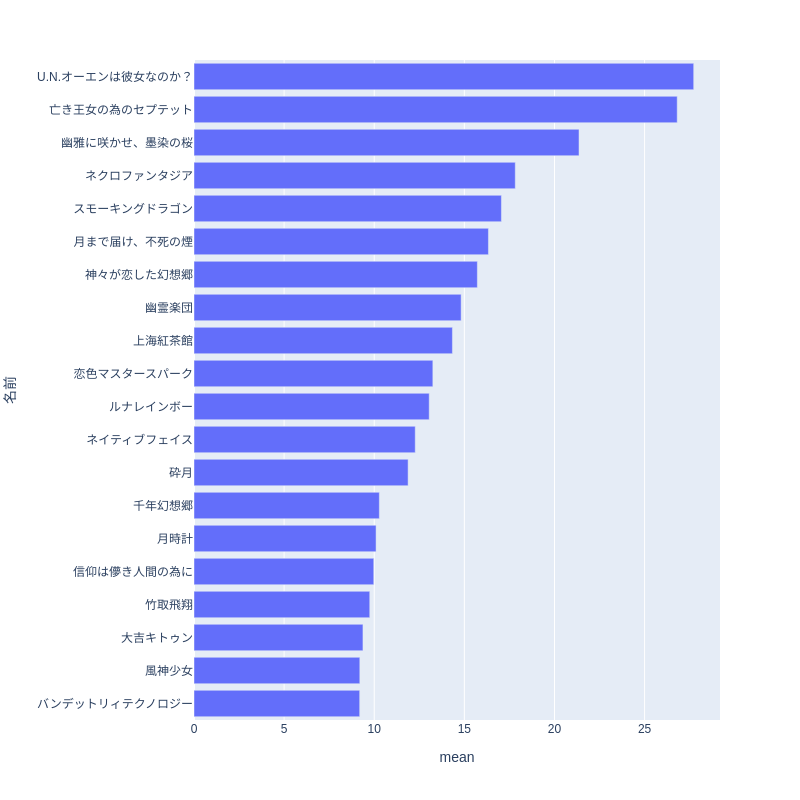
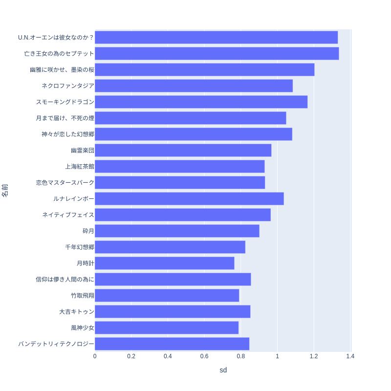
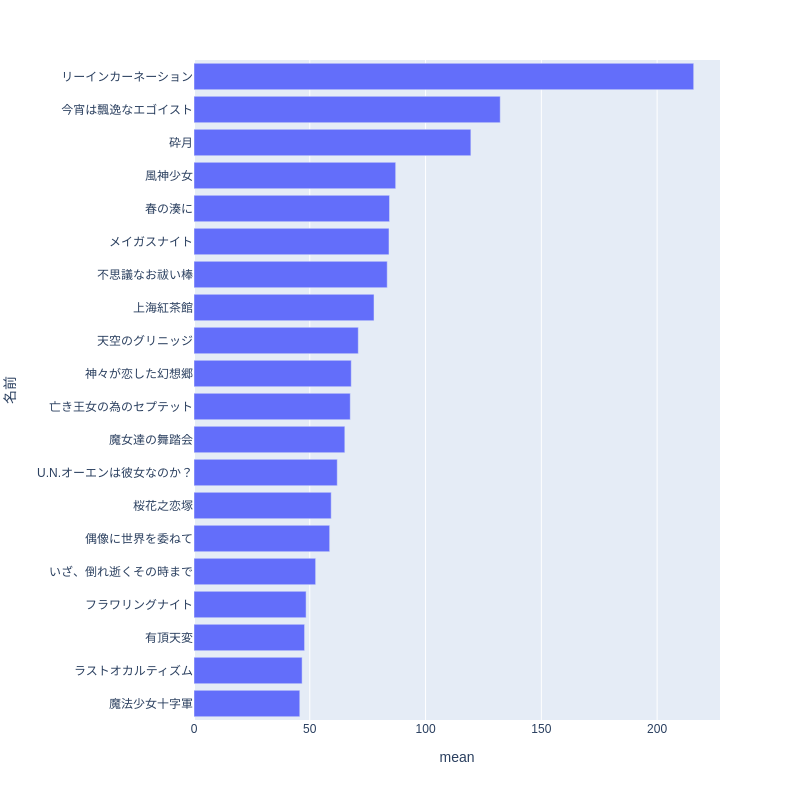
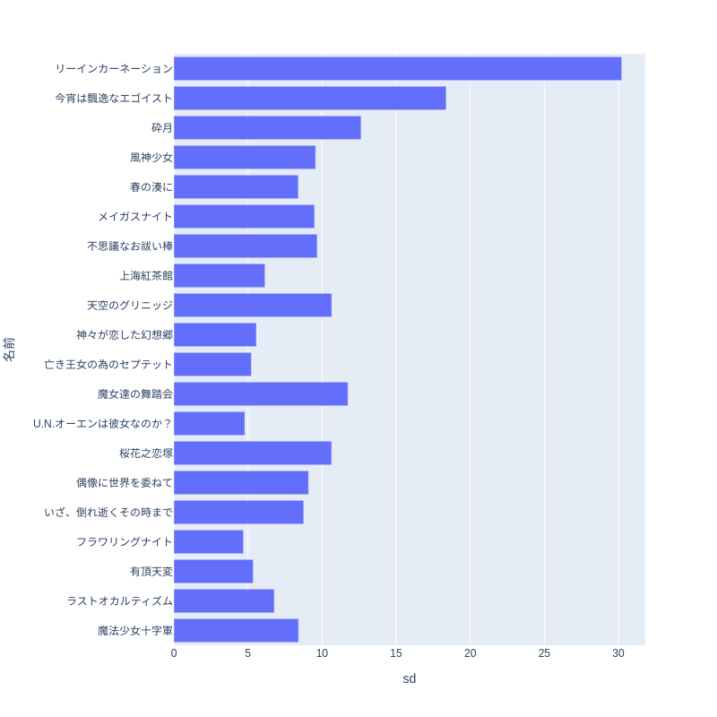

//ベイス
ここではベイズ統計モデリングという手法を使って投票データの傾向の説明を試みた結果を書きます。

=== ベイズ統計について

例えば人気投票の全期間を通じて人気のあるキャラクターは誰か、あるいは登場作品がどの程度人気に影響を与えているかを説明したいとします。

統計学では検定と呼ばれる方法で限られたデータから上記のような主張が言えるかどうかを判定することができます。しかしながらその解釈はやや難解でまた個々の仮説に対してそれぞれ検定を行うのは煩雑でもあります。

そこで別の方法としてデータが満たす性質を数式でモデル化し、モデルがどの程度データにあっているかを計算で求めるという手法がありベイズ統計モデリングと呼ばれます。この手法の場合モデルやその中のパラメーターがどの程度確からしいかという度合いも確率分布としてデータから推測するとします。確定している事実に対して確率を持ち出すのは奇妙にも思えますがわからないことに対する信念の度合いという風に解釈することができます。

データxから推定されるパラメーターθの満たす分布(事後分布) p(θ|x)の推定ではデータの性質を考えて設定した事前分布p(θ)とモデルによって決まる条件付き確率(尤度) p(x|θ)に対してベイズの定理と呼ばれる定理から

stem:[ p(\theta|x) \prop p(x|\theta)p(\theta)]

という形に書かれます。これは比例の形であり、これだけでは事後分布の分母の値はわかりません。そこでマルコフ連鎖モンテカルロ法(MCMC)と呼ばれる手法でサンプリングすることで分布(事後分布)を推定します。これはあるパラメーター全体が取りうる空間内のある点θを最初に決め、それに対してパラメータを異なる値θ'に確率

stem:[ min(1,(p(x|\theta')p(\theta'))/(p(x|\theta)p(\theta))) ]

で移動させます。このようにして一点一点逐次的に計算を行い、その軌跡(trace)を十分長い時間をかけて取ると一定の分布(定常分布)として事後分布p(θ|x)が得られることになります。

本書で用いるstanではさらにMCMCに加速度をつけるHMC(Hybrid Monte Carlo)という方法と遷移幅を調整するNUTS(No-U-turn sampler)という手法でサンプリングの効率を上げています。その詳細は「岩波データサイエンス」シリーズ、「計算統計II」などの書籍やStan Reference Manual(https://mc-stan.org/docs/reference-manual/hamiltonian-monte-carlo.html )をはじめとしたWeb上の情報を参照してください。

=== 言語とツール

ここではpythonのライブラリpystanを用いてモデルの記述をします。stanは統計モデルを記述する専用の言語であり以下に紹介するようにpythonやRなど他の言語から呼び出されて推論計算を実行する形式になっています。stanの文法の詳細は以下でのコードの説明および「StanとRでベイズ統計モデリング」などを参照してください。
他にもpythonのライブラリpymcを用いる方法もありpythonの文法に基づいたモデルの記述ができますが、推論で使われる内部的な計算は変わりありません。

以下の「モデリングと結果」で説明するキャラクターの最初のモデリング(和モデル)に対応したコードは以下のようなものになります。
```python
include::../analyse_char.py[]
```

stanやpymcではMCMCの計算に関するコードはライブラリの中で見えないようになっており、pythonからのstanで書かれたコードを呼び出す場合は上記コードのように単にbuildmodel.sample関数を実行するだけです。
呼び出される対象であるstanで書いたコードは以下のようになります。

```c++
include::../model/charpower_template_hyper.stan[]
```
data{}内が入力されるデータ、parameters{}内が推定対象のパラメーターを定義しておりmodel{}内がdataとparameterを用いて書かれるモデルの数式になります。ただしこのコードでは個々のキャラクターに関する添字iと投票回tに関する添字に対応するfor文の中で条件に一致した場合に項に値を代入するという書き方をしていてあとにあげる楽曲のモデルより複雑な形をしています。キャラクターの総数は投票回ごとに増えていくのでその要素数は変化していきます。それをstanコードに直接書くのではなくテンプレートという仕組みで変数としてpythonコードでstanのコードを変換するという方法を用いています。

事後分布のMCMCの計算結果はchainという時系列的な単位で行われます。複数のchainを計算しその結果を比較することで推論の計算が正しく行われたかがわかります。初期状態への依存が消え去っておらずモデルが妥当ではないと判断できることになります。
収束したか否かはGelman-Rubin統計量(stem:[Rhat])と呼ばれる量で判断します。これは初期状態の近く(burn-in期間)を除いたj番目のchainのi番目のパラメーターstem:[\theta_{ij}]の総ステップnとchain数mに対する

chain間分散 stem:[B=n/(m-1) \sum_{j=1}^m (\bar{\theta}_j - \bar{\theta} )^2]

chain内分散 stem:[W=1/(n(m-1)) \sum_{j=1}^m \sum_{i=1}^n (\theta_{ij}- \bar{\theta}_{i} )^2]

から計算される定常分布の分散

stem:[hatV = ((n-1)/n)W+(1/n)B ]

を用いて

stem:[hatR = \sqrt{hatV/W}]

と書かれます。stem:[hat{R}]が1~1.1の間の値の場合は事後分布が定常分布に収束したということを意味します。

traceとして得られた事後分布の可視化にはarvizというライブラリを使います。本書ではtrace, summary, forestというプロットの結果を記載します。これらはそれぞれ

- summary 各推定対象のパラメーターの平均、標準偏差、stem:[hatR]などのcsvデータ出力
- trace chainの時間的動き(右)とそのヒストグラムを重ね書き(左)する
//- forest 事後分布のばらつきを箱ひげ図でプロットする

といった関数を用います。この他にも豊富な事後分布の可視化方法がarvizのマニュアル https://python.arviz.org/en/stable/examples/index.html では紹介されています。

=== モデリングと結果

統計モデリングをするということは何かを説明したいという意図があります。前章のドメイン知識を含むような関係をモデルの数式で表現し、それがどの程度妥当なのかを投票データとMCMCによる計算によって明らかにします。

==== キャラクター

- 和モデル

キャラクターを

 - 整数作品の登場キャラ M
 - 整数作品のボスキャラ bossとそのレベル Lv
 - 非整数作品 Sub
 - 秘封倶楽部、その他

に分類しそれぞれ対応する影響力のパラメーター係数sigma b,s,と各キャラクターがそれぞれの属性に当たるかを示す変数との積の和によって構成されるモデルを考えます。i番目のキャラクターのt回目の投票での正規化した投票数stem:[nVote_{i,t}]がディリクレ分布Dirを用いて

stem:[
 nVote_{i,t} ~ Dir(\sum_{l=1}^{TM} M_{j(i,t-l),t-l} \sigma_{j,l}  + \sum_{l=1}^{TM} boss_{j(i,t-1),t-l}Lv_i b_{j(i,t-l),l} 
 +\sum_{l=1}^{TM} Sub_{j(i,t-l)} s_{j,l}+\epsilon_i
 )
]

と表されるとします。ディリクレ分布Dirは各要素の合計が1になるようなベクトルに値を持つ確率分布関数であり正規化した投票結果に対して用いることができます。カッコ内の値が大きければ大きいほど高い得票比率になりますが1を超えることはありません。また0を下回ることもありません。j(i,t-l)という表記はi番目のキャラクターのt-l回目の投票の登場作品を表す関数です。
コードは言語とツールのところにあげたpythonとstanのものでありj(i,t-l)という表記はiとtに対応するfor文の中で条件に一致したところで代入している部分に相当します。

非整数作品でのみ登場するキャラと再登場キャラは区別していませんが、同一の影響を受けると仮定しました。また以前の投票結果(人気)に応じて再登場の機会が変わると考えられますがその効果も明示的に入れていません。

このようにデータをグループ分けするモデルは階層モデルと呼ばれます。今回のキャラとそれが登場した整数作品のような階層的な関係が実際にある場合に自然な過程となります。データの分布の観点からは階層モデル、特に個体(individual)ごとのバラツキを考慮した混合モデルはデータのばらつきが大きくなってしまう過分散と呼ばれる問題に対処できるとされます(「個体差」の統計モデリング http://hdl.handle.net/2115/26401 )。

結果として計算された事後分布は以下のようになります。

.キャラクター和モデルの係数事後分布
image::img/posterior_charm_trace_hyper.png[width=80%][width=80%]

ベクトルのパラメーターは各要素を重ね合わせて描いています。chainによって分布が大きく変わらないことも確認できます。

個別のキャラクターに起因する項(indivisual)の影響が非常に大きくまたわかりづらいですが紅魔郷が強いことなどがそこに現れています。

//image::img/posterior_charm_hyper.png[width=40%][]

個体の効果が上位のキャラクターですが初期の投票回での咲夜の強さの寄与が大きく、実質3強状態になっています。それ以下とは大きな差があり、また幽々子、紫間で大きな差があります。その次のグループでは小傘がトップにいます。全キャラクターの結果に興味がある方はgithubのbook/img/char_indivisual_mean.png をご覧ください。
平均値が大きいものが標準偏差が大きい傾向、近年の作品では投票回数が少ないため標準偏差が大きいのもは想定通りです。これらの平均、標準偏差の値は箱ひげ図やバイオリンプロットと呼ばれる手法で重ね書きしたほうがわかりやすいのですが今回は断念しました。

.キャラクター和モデルの個体項平均値上位
image::img/char_indivisual_mean_20.png[width=40%][width=40%]

.キャラクター和モデルの個体項平均値上位の標準偏差
image::img/char_indivisual_sd_20.png[width=40%][width=40%]

- 和モデル(整数、非整数作品固有の寄与を入れた場合)

微妙に違うモデルとして整数、非整数作品固有の寄与の項を追加したバージョン
//sumnidivisual dth[i]=(sum(mains)+sum(bosses)+titlebase+sum(subs) +noninttitlebase +sum(hifuu)+sum(book)+sum(misc))+indivisual[i];
stem:[
 nVote_{i,t} ~ Dir(\sum_{l=1}^{TM} M_{j(i,t-l),t-l} \sigma_{j,l} + \sum_{l=1}^{TM} boss_{j(i,t-1),t-l}Lv_i b_{j(i,t-l),l} 
 +\sum_{l=1}^{TM} Sub_{j(i,t-l)} s_{j,l} 
  + titl_{j(i)} titlpow_j
  + noninttitl_{j(i)} noninttitlpow_j
  + \epsilon_i
 )
]

を試してみますと以下のように異なる結果が得られます。

.キャラクター和モデル(整数、非整数作品固有の寄与を入れた場合)の係数事後分布
image::img/posterior_charm_trace_withtitlesubtitle.png[width=80%][width=80%]

最初の和モデルと同様にindivisualの影響が強く、それと比較するとタイトルによる影響はあまり見えませんでした。boss,非整数作品による寄与はばらつきが少なく一様になっています。作品タイトル固有の効果titlepow,noninttitlepowは整数作品ボスとしての登場の効果と同程度で、非整数や自機としての登場寄りはその効果は弱いです。

個体の効果が上位のキャラクターとその値も和モデルと大きな違いはありません。

.キャラクター和モデル(整数、非整数作品固有の寄与を入れた場合)平均値上位
image::img/char_withtitlesubtitle_mean_20.png[width=40%][width=40%]

.キャラクター和モデル(整数、非整数作品固有の寄与を入れた場合)標準偏差
image::img/char_withtitlesubtitle_sd_20.png[width=40%][width=40%]

- 積和モデル

和モデルではindividualの影響が強く、タイトルによる影響はあまり見えませんでした。そこで個体の影響stem:[\epsilon_i]に登場作品など属性の影響がかけ合わさるようなモデルを考えました。

stem:[
 nVote_{i,t} ~ Dir( (\sum_{l=1}^{TM} M_{j(i,t-l),t-l} \sigma_{j,l} + \sum_{l=1}^{TM} boss_{j(i,t-1),t-l}Lv_i b_{j(i,t-l),l} 
 +\sum_{l=1}^{TM} Sub_{j(i,t-l)} s_{j,l})\epsilon_i
 )
]

.キャラクター積和モデルの係数事後分布
image::img/posterior_charm_trace_prodsum.png[width=80%][width=80%]

しかしながらこのモデルは収束せず事後分布のtraceはバラバラになってしまいました。すなわち妥当ではないモデルと言えるのではないでしょうか。しかし後述するように音楽に関してはそうはなりませんでした。

==== 音楽

キャラと同様に和モデル、積和モデルを考えます。違いは旧作、秘封倶楽部、音楽CDリリース作品が大きな割合を占めていることでそこでは登場順序はあまり重要ではないという仮定をしています。また非整数作品での再録曲の情報は用いませんでしたが実際には人気に影響があると考えられます。

- 和モデル

キャラクターの場合と同様に

 - 整数作品のボスキャラ、道中曲とそのレベル inttitlepow,平均 mu_t,分散 sigma_t
 - 非整数作品 noninttitlepow,平均 mu_i, 分散 sigma_i
 - 書籍についているCD bookpow
 - 秘封倶楽部 hifuupow
 - 音楽CDでのリリース(秘封含む) CDpow
 - 旧作 oldpow
 - 西方 seihoupow
 - オリジナル orgpow
 - その他 otherpow

の各寄与を表す係数の個別の項ε(indivisual)を加えたものをディリクレ分布の引数としています。

そのコードとモデルは以下のようになります。

```c++
include::../model/music_template_sum.stan[]
```
```python
include::../analyse_music.py[]
```
またキャラクター解析の時と異なりある属性に含まれるかどうかというflag(is*という変数)をdataframeとして持っていますがこの方がデータサイズは大きくなるものの計算が非常に高速化することがわかりました(キャラクターの場合は約2日、楽曲は30分程度)。

事後分布の計算結果は以下のようになります。

.楽曲和モデルの係数事後分布
image::img/music_posterior_charm_trace_sum.png[width=50%][width=50%]
//image::img/music_posterior_charm_sum.png[width=40%][width=40%]

各係数(pow)と整数、非整数作品の平均、分散(mu_t,mu_i,sigma_t,sigma_i)の分布がなめらかになっていてより一致性が高いように見えます。キャラクターの場合と同様個体(indivisual)の項が最も大きくまたばらついており次に整数作品そして非整数作品の寄与係数が大きく、またばらついています。それと比べるとその他（書籍、秘封倶楽部、CD、旧作、西方、オリジナル、その他）の寄与は小さいです。またそれらの事後分布は0に近い方が大きな指数分布に近い形をしています。

individualの平均値上位はU.N.オーエンやセプテットが突出しており、その次に墨染の桜、ネクロファンタジアと続き紅魔郷、妖々夢のラストに近い曲であり妥当、王道というと言えるのではないでしょうか。しかしスモーキングドラゴンはかなり以外でもとの人気投票のデータを見てもそれほど得票は大きくありません。データ処理かプログラムへの渡し方にバグがあるのではないかという懸念がありますが一方でそれ以外の楽曲は妥当なので不思議さが残ります。標準偏差も大まかには平均と同じで新作はばらつきしかしこれを見てもスモーキングドラゴンの大きさの説明は付きません。全楽曲の結果に興味がある方はgithubのbook/img/indivisual_music_sum_mean.png をご覧ください。

.楽曲和モデルの個体項平均値上位
[width=50%]

.楽曲和モデルの個体項平均値上位の標準偏差
[width=50%]

- 積和モデル

個別楽曲の項stem:[\epsilon_i](indivisual)を他の項の総和にかけ合わせたモデルです。このモデルはキャラクターの場合とは異なり収束しました。整数タイトル、非整数タイトルの係数のばらつきは和モデルより小さく、タイトルによってはその力が秘封や書籍、CDよりも小さいです。非整数タイトルのほうが平均して寄与が大きいことがわかります。
また旧作は平均的寄与は小さいのですが、以下に示すようにその中には作品の寄与に依らない突出した個性を持つ楽曲があります。

.楽曲積和モデルの係数事後分布
image::img/music_posterior_charm_trace_sumprod.png[width=50%][width=50%]

individualの値上位を見るとレインカーネーションを筆頭に旧作のものがいくつかあり実力派という感じの並びです。U.N.オーエンやセプテットもあり作品効果だけではない力を感じます。全楽曲の結果に興味がある方はgithubのbook/img/indivisual_music_sumprod_mean.png をご覧ください。

.楽曲積和モデルの個体項平均値上位
[width=40%]

.楽曲積和モデルの個体項平均値上位の標準偏差
[width=40%]

==== 事前分布

パラメーターに加えられる仮定である事前分布は計算の収束に大きな影響を与えます。stanでは事前分布を指定しない場合は一様分布が用いられますが、無限の区間幅を持つため現実的ではありません。現実的な範囲内に収めることが必要でありまたそうすることにより事後分布が収束するスピードが早まります。
正規分布があるいはパラメータが正の値を持つという仮定を置くのであれば指数分布、整数のパラメーターに対しては対してはポアッソン分布などが用いられます。「StanとRでベイズ統計モデリング」にも事前分布の選択について書かれており、逆ガンマ分布あるいは半コーシー分布という裾の広い分布関数を使用すると良いとされています。

https://stats.stackexchange.com/questions/237847/what-are-the-properties-of-a-half-cauchy-distribution

==== 発展的話題、展望

上記のモデルに組み入れられなかった特徴として

- 新作の影響の持続性のパラメーター化
- 楽曲の再録
- 作品、キャラ、楽曲関係と因果関係

などがあります。今、推し活が盛んです。東方でも何が入り口になるのかを知ることはコミュニティの恒常的な発展にとって重要です。アンケートデータからは投票者の入れ替わりが激しいことがわかりましたが、作品から特定のキャラクターを推すようになるのか、音楽から入っていくのかなどの説明が可能になるかもしれません。このような因果関係の推論は統計学でも一分野を築いています。また非整数作品での再登場、再録はその時点までの人気で決定されていると考えられそこまで説明できれば有益です。

* 他のデータの利用

pixivの画像やニコニコ動画、静画ではタグに対応したコンテンツが豊富にあり、時間的解像度も高いです。カップリングなどの組み合わせがどこまでも詳しく解析できます。またpixiv百科事典やニコニコ大百科には著名な東方アレンジの情報が豊富にあり解析しがいがあるかもしれません。

* 予測

機械学習は予測のための手法であるのに対し、統計分析は説明のための手法であると言われることがあります。しかしながら今回の投票データのような時系列に関するデータがあれば、そこから未来を予測したいという願望が出てきます。記述統計のところで触れましたが徐々に新作登場時の人気の勢いがなくなり上位が固定化しています。そうすると中、下位のキャラクターのテコ入れがあると活性化すると予測できますが、そんな中2023年東方獣王園が発表され、獣キャラの活躍が期待されています。

==== 別の観点でのモデリング

上ではキャラクター、音楽を主体としたモデリングをしましたが、投票者の行動に基づいたモデリングも考えられます。すなわち個々の票に対して作品選択、キャラクターの選択を確率変数として推しへの票もモデリングに取り入れられそうですが、その場合票数分だけ計算の繰り返しが必要になり時間がかかりそうです。
