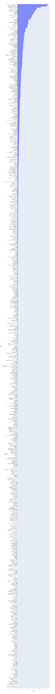

//ベイス
ここではベイズ統計モデリングという手法を使って投票データの傾向の説明を試みた結果を書きます。

=== ベイズ統計について

例えば　説明したいとします。
度合いも確率分布としてデータから推測するとします。

データが満たす性質をモデル化する

事前分布p(\theta)に対して
パラメーター\theta推定には
データxから　
マルコフ連鎖モンテカルロ法(MCMC)などの手法でサンプリングすることで分布(事後分布)を推定します。

=== 言語とツール

ここではpythonのライブラリpystanを用いてモデルの記述をします。stanは統計モデルを記述する専用の言語で以下に紹介するようにpythonやRなど他の言語から呼び出されて推論計算を実行する形式になっています。
文法の詳細は「」などを参照してください。
他にもpythonのライブラリpymcを用いる方法もあり　ますが、推論で使われる内部的な計算は変わりありません。

事後分布の可視化にはarvizというライブラリを使います。

=== モデリングと結果

統計モデリングをするということは何かを説明したいという意図があります。

このようにデータをグループ分けするモデルは階層モデルと呼ばれます。今回のキャラとそれが登場した整数作品のような階層的な関係が実際にある場合に自然な過程となります。
データの分布の観点からは階層モデルはデータのばらつきが　過分散と呼ばれる問題に対処できるとされます(「個体差」の統計モデリング http://hdl.handle.net/2115/26401 )。

==== キャラクター

が初登場の作品に

- 和モデル
//hyper dth[i]=sum(mains)+sum(bosses)+sum(subs)+hifuu+book+misc+indivisual[i];

stem:[
 normVote_{i,t} \sim Dir(\sum_{l=1}^{TM} main_{j(i,t-l),t-l} \sigma_{j,l} \\ + \sum_{l=1}^{TM} boss_{j(i,t-1),t-l}Lv_i b_{j(i,t-l),l} 
 +\sum_{l=1}^{TM} sub_{j(i,t-l)} s_{j,l}+\epsilon_i
 )
]

Dirというのはディリクレ分布で各要素の合計が1になるようなベクトルに値を持つ確率分布関数です。正規化した投票結果に対して用いることができます。Dirのパラメーターは
 - 整数作品の登場キャラ
 - 整数作品のボスキャラ
 - 非整数作品
 - 秘封倶楽部、その他

に対応する推定対象のパラメーターである係数b,s,と各キャラクターがそれぞれの属性に当たるかを示す変数との積の和
で構成されます。非整数作品でのみ登場するキャラと再登場キャラは区別していませんが、

また以前の投票結果

別のモデルとして投票期間によらない作品の影響力を加えたモデル

も考えられます。結果として計算された事後分布は以下のようになります。

image::img/music_posterior_trace_charm_sum.png[width=40%][width=40%]

ベクトルのパラメーターは各要素を重ね合わせて描いています。

image::img/music_posterior_charm_hyper.png[width=40%][width=40%]

特にindivisualの影響が大きく紅魔郷が強いこと、　などがそこに現れています。
以下のモデルを考えます。

- 和モデル(旧作、秘封、その他に時間依存性を入れた場合)

//sumnidivisual dth[i]=(sum(mains)+sum(bosses)+titlebase+sum(subs) +noninttitlebase +sum(hifuu)+sum(book)+sum(misc))+indivisual[i];
stem:[
 nVote_{i,t} ~ Dir(\sum_{l=1}^{TM} M_{j(i,t-l),t-l} \sigma_{j,l} + \sum_{l=1}^{TM} boss_{j(i,t-1),t-l}Lv_i b_{j(i,t-l),l} 
 +\sum_{l=1}^{TM} Sub_{j(i,t-l)} s_{j,l} + \epsilon_i
 )
]

image::img/posterior_charm_sum.png[width=40%][width=40%]

最初の和モデルと同様にindivisualの影響が強く、タイトルによる影響はあまり見えませんでした。

- 積和モデル

indivisualの影響が強く、タイトルによる影響はあまり見えませんでした。そこで

stem:[
 nVote_{i,t} ~ Dir( (\sum_{l=1}^{TM} M_{j(i,t-l),t-l} \sigma_{j,l} + \sum_{l=1}^{TM} boss_{j(i,t-1),t-l}Lv_i b_{j(i,t-l),l} 
 +\sum_{l=1}^{TM} Sub_{j(i,t-l)} s_{j,l})\epsilon_i
 )
]

image::img/posterior_charm_trace_sumprod.png[width=40%][width=40%]

しかしながらこのモデルは収束せず事後分布はバラバラになってしまいました。すなわち妥当ではないと言えるのではないでしょうか。しかし後述するように音楽に関してはそうはなりませんでした。

==== 音楽

キャラと同様に和モデル、積和モデルを考えます。違いは旧作、秘封倶楽部が大きな割合を占めていることでそこでは登場順序はあまり重要ではないという仮定をしています。また再録曲の情報は用いませんでした。実際には人気に影響があると考えられます。
またキャラ解析の時との比較としてある属性に含まれるかどうかというflagをdataframeとして持っておく方が計算が高速化することがわかりました。

- 和モデル

stem:[
 nVote_{i,t} ~ Dir(\sum_{l=1}^{TM} boss_{j(i,t-1),t-l}Lv_i b_{j(i,t-l),l} 
 +\sum_{l=1}^{TM} sub_{j(i,t-l)} s_{j,l}+\epsilon_i
 )
]

image::img/music_posterior_charm_trace_sum.png[width=50%][width=50%]
//image::img/music_posterior_charm_sum.png[width=40%][width=40%]

[width=50%]

[width=50%]

- 積和モデル

このモデルはキャラクターの方とは異なり収束しました。

image::img/music_posterior_charm_trace_sumprod.png[width=50%][width=50%]
// image::img/music_posterior_charm_sumprod.png[width=40%][width=40%]

==== 事前分布

パラメーターに加えられる仮定である事前分布は計算の収束に大きな影響を与えます。stanでは事前分布を指定しない場合は一様分布が用いられますが、無限の区間幅を持つため現実的ではありません。現実的な範囲内に収めることが必要でありまたそうすることにより事後分布が収束するスピードが早まります。
正規分布があるいはパラメータが正の値を持つという仮定を置くのであれば指数分布、整数のパラメーターに対しては対してはポアッソン分布などが用いられます。
「StanとRでベイズ統計モデリング」にも書かれており、逆ガンマ分布あるいは半コーシー分布という裾の広い分布関数を使用すると良いとされています。stanでは
```
```
を用いて実現できます。

==== 別の観点でのモデリング

上ではキャラクター、音楽を主体としたモデリングをしましたが、投票者の行動に基づいたモデリングも考えられます。

=== 発展的話題、展望

- 作品、キャラ、楽曲関係と因果推論

推し活が盛んです。
何が入り口になるのかはコミュニティの恒常的な発展
アンケートデータからは入れ替わりが激しいことがわかりましたが
キャラ、楽曲関係と因果推論

非整数作品での再登場、再録はその時点までの人気で決定されていると考えられます。

- モデルの妥当性と情報量基準

モデルの
特異な構造を持つモデルに対しても適用できる　WAICを

- 他のデータの利用

- 予測

機械学習は予測のための手法であるのに対し、統計分析は説明のための手法であると言われることがあります。しかしながら
