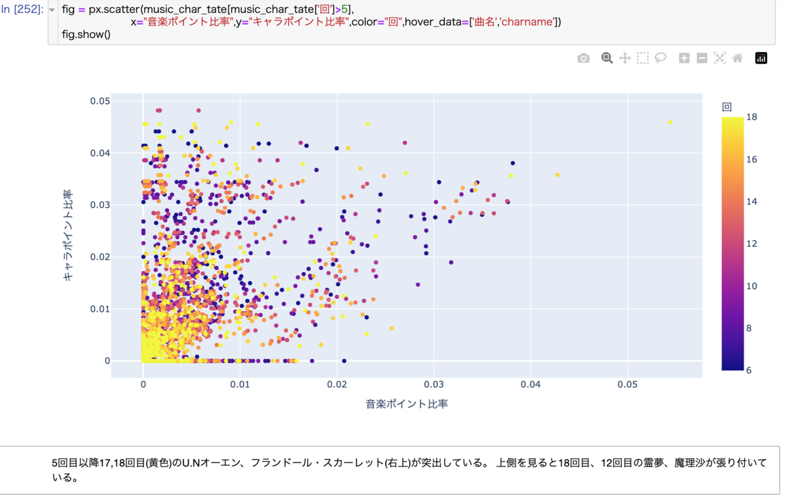
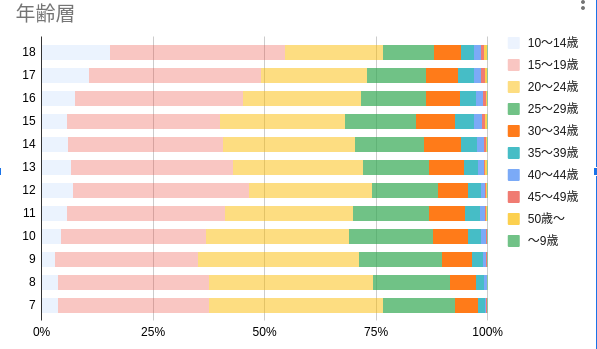

//記述統計編
ここでは投票結果のデータをグラフ化し大まかな傾向を見てみます。
18回分のデータ、キャラクター270人、591曲にのぼり全部をプロットすると以下のように点が重なり合って(特に白黒では)様子がよくわからないので作品ごとにまとめた可視化してデータの傾向を見る方法は探索的データ解析(EDA)とも呼ばれます(EDA.ipynbにその手順があります)。

[]

発見された特徴は次のベイズ統計モデリングの章でのモデリングのアイデアにしています。

=== 概要と手法

python(さらには他の言語)のライブラリplotyを使うと散布図や棒グラフその他多様なグラフを描くことができます。jupyter notebook上のGUIで操作できるインタラクティブなグラフ、アニメーションも描くことも出来ますが本書では表現できないのでブログ、githubを参照ください。
pandasのmerge関数による投票結果と登場作品の表の貼り付けやgroupbyによる作品ごとの結果の集約の手法を用いてプロットの元となるデータを作成しました。
そのコードは

character_music_correlation.ipynb

scrape_music_correlation.ipynb

にあります。

概要は以下のようになります。

投票総数には階数によりかなりの変動があり、特に第10回、第11回、第15回の減少が大きいです。

.キャラクター、楽曲、作品タイトルの総投票数の変遷
[width=50%]

投票総数で正規化すると近年の紅魔郷人気が目立ちます。

.正規化したタイトル投票比率
[width=50%]

=== アンケートの結果

アンケートでは年齢や地域、東方プロジェクトを知った時期、感想などを記載できます。
20年に渡り平均年齢は約21歳から19.5歳に減少し分散が大きくなりつつあります。一貫して男性比率が減少しています。海外、特に東アジアからの投票が日本の一地域に匹敵する数だけ存在していてその割合は増加しています。

[width=50%]

[width=50%]

[]

[]

.住んでいる地域
[]

=== 投票結果のばらつき、多様性

時が経つにつれて作品、キャラクターが増え、それぞれのファンがついていく一方で初期の作品特に紅魔郷の人気は根強いです。
東方Project全体の人気の多様性を測る指標として以下のように定義されるエントロピーstem:[ S=\sum_i r_i \log (r_i)]という量で表すことができます。r_iは相対的な得票率です。これを投票回別にプロットしたのが以下です。

.キャラクター投票結果のエントロピー
[width=50%]

.楽曲投票結果のエントロピー
[width=50%]

.作品投票結果のエントロピー
[width=50%]

キャラクター投票結果で第17回(2021年)以降、音楽投票結果で第15回(2019年)以降に多様性の減少が見られます。 2019年以降であり変動が緩やかであることから新型コロナウイルスの流行による行動変容というよりは相次ぐソーシャルゲームのリリース(キャノンボール 2019~2020,ロストワールド 2020~,ダンマクカグラ 2021~2022、アルカディアレコード 2022〜)によるものと考えられます。これがもたらした影響を次の相関で少し詳しく見ることができます。

=== キャラクター-楽曲間の人気の相関

キャラクターと対応する楽曲間の人気の相関、およぼそこからのズレを可視化することで見ていきます。

[width=60%]

[width=60%]

非想天則、花映塚は相対的に音楽が人気(ゲーム性によるのか)、永夜抄は相対的に作品が人気
 
大まかには作品ポイントとキャラポイントは相関している。再登場のみで初出キャラがいない(非整数)作品はキャラ集計ポイントがNa ここでは0に張り付いています。

投票回による違いはあまりないです。
紅魔郷の人気が突出している。主人公(霊夢、魔理沙)は旧作が初登場で人数が少ないので比率は少なく見えている

=== 投票回による変動

作品ごと集計した結果からキャラと音楽の相関の時間的変化を見てみます。

[width=80%]
[width=80%]
[width=80%]

第1~3回: 初出作品(妖々夢、永夜抄)が人気トップになる激しい時代

[width=50%]
[width=50%]
[width=50%]
[width=50%]
[width=50%]

第5~9回: 新作(風神録、地霊殿)が第二グループを形成し始めるキャラ人気はトップグループより低いが音楽人気は高い。
新作(星蓮船、神霊廟)の初出が既存の人気作品ほどではなくなる。

[width=50%]
[width=50%]
[width=50%]
[width=50%]
[width=50%]
[width=50%]
[width=50%]

第11回以降 新作が初回から下位グループに位置するようになり、紅魔郷の人気独走が進展している。

=== ドメイン知識と知見

データはただの数字の羅列ではなくその出自に応じた規則性や特性がありそれを知っていると理解の糸口になります。データ分析業界の言葉でそれはドメイン知識と呼ばれます。例えば東方の場合冒頭のすごいざっくりした紹介で述べたことのほかに

- 回を経ることに登場キャラクター、楽曲が増えていく
- 後ろの方のステージのキャラクター、楽曲の人気が高い
- 姉妹キャラ、同時登場キャラクターは投票数が近くなるが妹の方が人気が高いことが多い
- 古い作品の影響は長く続き、最近の作品の影響の持続は短いように見える

などの事実があります。グラフで可視化することでその傾向の一部を見いだすことができ、次の章の統計モデリングに組み込むことができます。